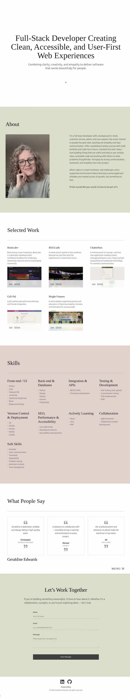

# My Portfolio
<br>

# [Live Site - Click here](https://geraldine-edwards.github.io/personal-portfolio/)
<br>


A personal portfolio website built with [React](https://react.dev/) , [TypeScript](https://www.typescriptlang.org/) , and [Vite](https://vitejs.dev/) .  


<br>

Showcasing selected projects, skills, and contact information with a focus on accessibility, clean code, and user-first design.

---

<br>

## Features

- **Responsive & Accessible:** Mobile-friendly and screen reader accessible.
- **Animated UI:** Smooth transitions with Framer Motion.
- **Custom UI Components:** Includes reusable components like CloseButton, SectionDivider, and SectionHeading.
- **Custom Hooks:** Accessibility-focused hooks such as UseEscapeKey and UseFocusOnOpen.
- **Focus Management:** Uses focus-trap-react for accessible modals and overlays.
- **Project Showcase:** Live demos and GitHub links for each project.
- **Skills & Testimonials:** Clearly organized, easy to read.
- **Contact Form:** Formspree-powered, spam and GDPR-protected contact form.
- **Site-wide Navigation:** Easy navigation with React Router.
- **Automated Deployment:** Built and deployed with GitHub Actions and GitHub Pages.


---

<br>

## Preview


---

<br>

## Languages 


---

<br>

## Frameworks & Libraries


---

<br>

## Programs & Tools


---

<br>

## Getting Started

To run this project locally:

1. Clone the repository:
```bash
git clone https://github.com/Geraldine-Edwards/personal-portfolio.git
```

2. Install dependencies:
```bash
npm install
```

3. Start the development server:
```bash
npm run dev
```

4. Open [http://localhost:5173](http://localhost:5173) in your browser.

Preview the production build:
```bash
npm run build
npm run preview
```

5. Lint your code:
Preview the production build:
```bash
npm run lint
```
This project uses ESLint for code quality checks.

6. Deploy to GitHub Pages:

- Automated deployment is set up via GitHub Actions.

To deploy manually, run:
```bash
npm run deploy
```
This uses the gh-pages branch for deployment.

---

<br>

## Project Structure & Custom Features
### Custom UI Components:
Reusable components like CloseButton, SectionDivider, and SectionHeading are used throughout for consistency and maintainability.

### Custom Hooks:
Includes UseEscapeKey and UseFocusOnOpen for accessibility and keyboard navigation.

### PWA Support:
Includes a web manifest and SVG icons for installability and better mobile experience.

### Strict TypeScript:
The project uses strict TypeScript settings for type safety and reliability.

---

<br>

## Accessibility Highlights

- Semantic HTML structure with landmark elements (`<header>`, `<nav>`, `<main>`, `<section>`, `<footer>`)
- All interactive elements are keyboard focusable and have visible focus indicators
- Logical tab order and no focus traps
- High color contrast and readable font sizes
- Clear labels for all form fields and buttons
- ARIA labels for icons and custom controls
- Responsive design for all devices
- Privacy policy modal and Navigation menu list directs focus to the close button for screen readers

---

<br>

## Credits

- Google Fonts: Typography and font selection.
- Favicon.io: Favicon generation.
- react-icons: Scalable SVG icon components in React.
- Formspree: Secure contact form backend.
- Framer Motion: UI animations and transitions.
- focus-trap-react: Accessibility for modals and overlays.
- React Router: Site navigation and routing.
- Shields.io: Badge generation for README.
- GitHub Actions: Automated build and deployment to GitHub Pages.

---

<br>

## Contact
For feedback or inquiries, please reach out via the contact form on the website.

---

<br>

### Notice
This project is for personal use and is not open for contributions or reuse.